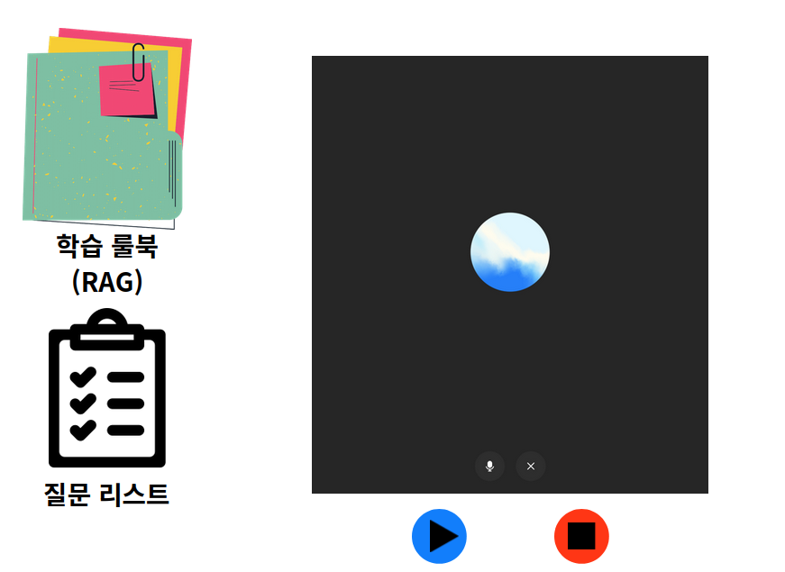
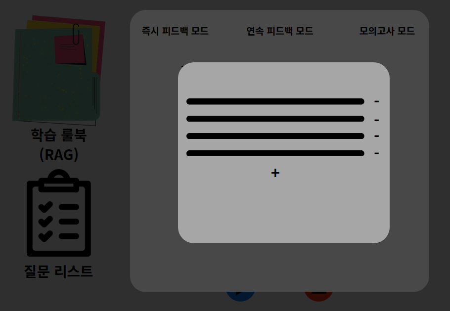
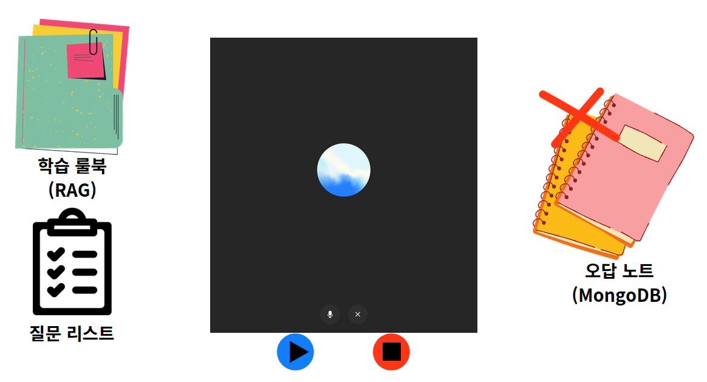

## 1. 제품 개요

### 1.1 문제 정의
- 사용자는 **오픽 학습을 시작**하고 **대화형으로 빠른 피드백**을 원한다.
- 기존 보이스 모델은 **커스터마이징이 제한**되어, 사용자가 “따로 배운 내용 위주”로 학습하기 어렵다.

> 어디서부터 건드려야 하지?
> 내가 따로 배운 내용 위주로 오픽 공부를 할 수는 없을까?

### 1.2 솔루션 요약
오마이픽은 다음 기능 조합으로 개인화 학습을 제공한다.
- **학습 룰북(RAG)** 업로드 및 적용
- **질문 리스트** 기반 진행 + 모드 선택(즉시/연속/모의고사, 랜덤 그룹)
- **오답 노트(MongoDB)** 로 “자주 틀리는 부분” 중심 피드백 제공
- **피드백 언어(한국어/영어)** 선택
- **저렴한 사용**을 위한 모델 셀렉터 및 API Key 기반 비용 제어
- 사용자의 로컬 환경에서 직접 실행하는 형태의 소프트웨어

## 챗봇

- 설명: 사용자는 “빠르게 피드백”을 받는다.

- 피드백 구성(최소 출력)

    1. 요약(1~2문장)

    2. 교정 포인트 3개(문법/표현/논리 중 최소 2종 포함)

    3. 개선 예시 답변 1개(사용자 답변 길이의 0.8~1.2배)

    4. 룰북 근거(있으면 1개 이상)

- AC

    - AC-01: 즉시 피드백 모드에서 “답변 종료 → 피드백 표시” p95 ≤ 10초

    - AC-02: 피드백 항목 누락률 0%(필수 4종 구성)

    

## 학습 룰북

-  사용자가 학습한 문장/표현/전략/금지 패턴 등을 포함한 자료(파일 첨부)
- 사용자가 직접 파일 추가해둠.
    - 마크다운 파일 지원
    - 사용자에게 Notion 사용 후 (.md) 파일 추출 권고
    - 지나치게 길게 만들면, 비용이 많이 나갈 수 있으니 쪼개서 파일 첨부할 것을 권고
- 파일 추가 시 텍스트 추출하여 인덱싱

- 설명: 사용자는 파일을 첨부하여 “학습 룰북”을 등록하고, 학습 중 룰북이 피드백에 반영되어야 한다.
  오마이픽
- 세부 기능
    - 룰북 파일 업로드 - 사용자 PC에 저장되므로 제한은 없어도 무방
    - 룰북 활성/비활성 토글
- AC
    - 업로드 성공 시 3초 이내(네트워크 제외) 목록에 표시(p95 ≤ 3s)

## 질문 리스트

> 원하는 질문을 받고 싶어.

- 세부 기능
    - 질문 리스트 생성/삭제
    - 질문 추가/수정/삭제
- AC
    - 리스트 내 질문 개수 1~200개 지원
    - “다음 질문” 전환이 500ms 이내(p95 ≤ 0.5s)
- 사용자 지정 질문 시나리오 목록(순서대로 진행)

### 학습 모드 지원(즉시/연속/모의고사)
- 설명: 질문 리스트 화면에서 모드를 선택한다(즉시 피드백/연속 발화/모의고사)
- 모드 정의(동작 규칙)
    1. **즉시 피드백 모드**: 질문 1개 답변 종료 시점마다 피드백 1회 생성 후 TTS로 설명
    2. **연속 발화 모드**: 그룹에 관계없이 질문 추출, N개 질문 답변 후(기본 N=3, 사용자 설정 1~10) 묶음 피드백 1회 생성
        1. N회 진행 후 TTS로 설명
        2. 해당 피드백은 "오답노트" 서비스에 받은 피드백 횟수 + 1로 누적
    3. **모의고사 모드**: 사전 정의된 질문 그룹 순서대로 랜덤 출제(그룹당 사용자가 원하는 횟수대로 추출)
        - 중복 추출 X
        - 더이상 추출할 질문 없을경우, 건너뛰기
- AC
    - 모드 변경 시 즉시 반영(1초 이내)
    - 모의고사 모드에서 “중간 피드백 생성”이 발생하지 않음(0건)

## 오답노트

- 설명: “자주 틀리는 부분”에 대해 피드백을 받고, 오답 노트(MongoDB)에 누적한다.
- 세부 기능
    - 오답노트 조회
        - 피드백마다 핵심 내용 255자 이내 표현
        - 오류 태그/패턴 빈도 내림차순 정렬 및 “횟수” 표시(예: 3회, 2회, 1회)
    - 오답노트 추가
        - 큐로 최근 30개 피드백 관리
        - 최근 발생한 피드백 중 겹치는 피드백이 있으면, 해당 피드백 카운트 추가
        - 최근 발생하지 않은 피드백이라면, 새로 추가
        - 0개 되면, 보여주는 피드백에서 제거

## 모델 셀렉터 & API Key

저렴하게 쓰고 싶다.
API 직접 연결.

- 세부 기능
    - 모델 선택(최소 3개 옵션: GPT/Claude/Gemini)
    - 모델 등급 선택 (실제 모델 기반 - gpt-o3-mini 등)
    - API Key 등록/검증(형식 검증 + 인증 테스트 호출 1회)
- AC
    - API Key는 클라이언트 로그/크래시 리포트에 포함되지 않음(0건)   
