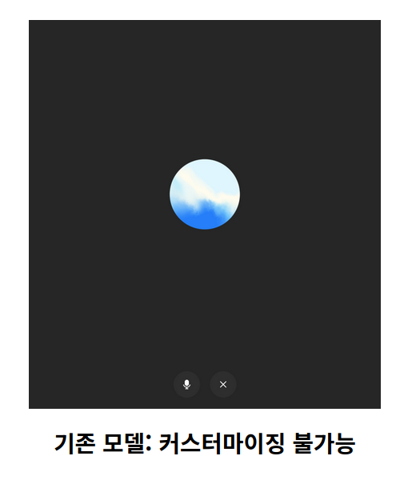
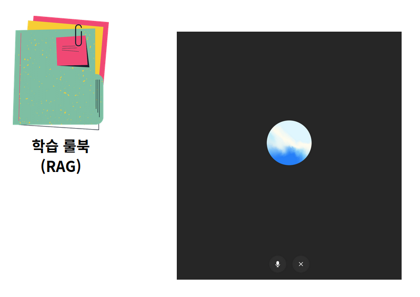
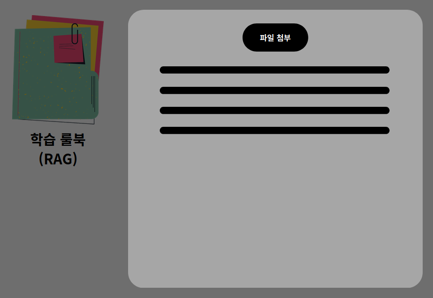
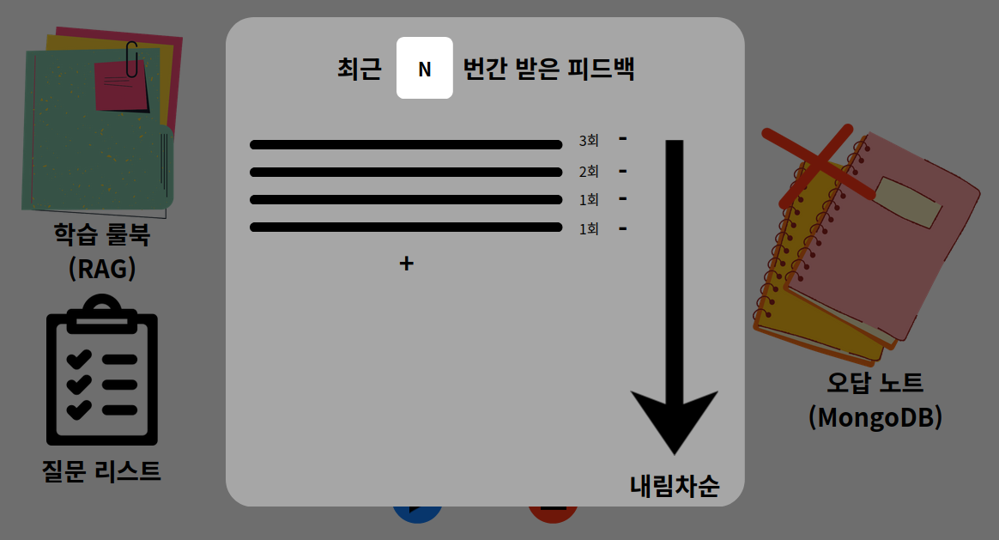
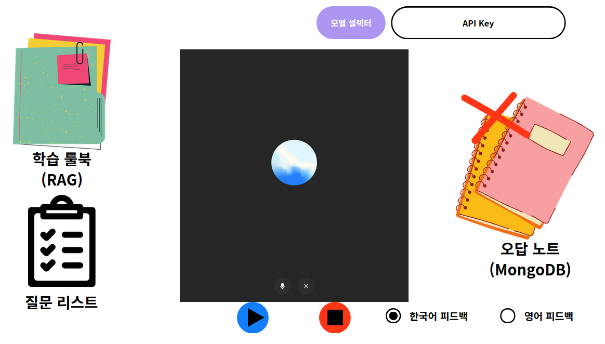

## 1. 제품 개요

### 1.1 문제 정의
- 사용자는 **오픽 학습을 시작**하고 **대화형으로 빠른 피드백**을 원한다.
- 기존 보이스 모델은 **커스터마이징이 제한**되어, 사용자가 “따로 배운 내용 위주”로 학습하기 어렵다.

> 어디서부터 건드려야 하지?
> 내가 따로 배운 내용 위주로 오픽 공부를 할 수는 없을까?

### 1.2 솔루션 요약
오마이픽은 다음 기능 조합으로 개인화 학습을 제공한다.
- **학습 룰북(RAG)** 업로드 및 적용
- **질문 리스트** 기반 진행 + 모드 선택(즉시/연속, 랜덤 그룹)
- **오답 노트(MongoDB)** 로 “자주 틀리는 부분” 중심 피드백 제공
- **피드백 언어(한국어/영어)** 선택
- **저렴한 사용**을 위한 모델 셀렉터 및 API Key 기반 비용 제어
- 사용자의 로컬 환경에서 직접 실행하는 형태의 소프트웨어

### 1.3 음성 세션 원칙

- 본 제품의 음성 학습은 **녹음 후 일괄 처리**가 아닌, **실시간 대화형 세션**을 기본으로 한다.
- 사용자 `세션 시작` 시 시스템이 첫 질문을 자동 제시한다.
- 답변 종료는 자동 감지(STT/VAD)하며, **3초 이상 침묵**을 응답 종료로 간주한다.
- STT 수집은 **질문/피드백 TTS 출력이 끝난 뒤에만 시작**한다.
- 즉시 피드백 모드: **피드백 TTS를 먼저 출력한 뒤 다음 질문 TTS를 출력**한다.
- 연속 질문 모드: **질문만 TTS로 출력**하고, 피드백은 텍스트로 저장한다.
- 사용자 `세션 종료`(강제 종료) 시 진행 중인 녹음/응답을 함께 종료하며, 강제 종료된 세션에 대한 추가 요약 피드백은 생성하지 않는다.
- **모든 모드 공통으로 질문 소진 시 세션을 자동 종료**한다.

## 챗봇

- 설명: 사용자는 “빠르게 피드백”을 받는다.

- 피드백 구성(최소 출력)

    1. 요약(1~2문장)

  2. 교정 포인트 3개(문법/표현/논리 각 1개)

  3. 추천 표현 3개(Filler/Adjective/Adverb 각 1개)

    4. 개선 예시 답변 1개(사용자 답변 길이의 0.8~1.2배)

    5. 룰북 근거(있으면 1개 이상)

- 연속 발화 모드 피드백 규칙
    - 1회 피드백 안에 **문답별 피드백 항목 N개**를 포함한다.
    - 각 항목은 해당 질문/답변 쌍 기준으로 생성된다.

- AC

    - AC-01: 즉시 피드백 모드에서 “답변 종료 → 피드백 표시” p95 ≤ 10초

  - AC-02: 피드백 항목 누락률 0%(필수 5키 구성: summary/correctionPoints/recommendation/exampleAnswer/rulebookEvidence)

    

## 학습 룰북

-  사용자가 학습한 문장/표현/전략/금지 패턴 등을 포함한 자료(파일 첨부)
- 사용자가 직접 파일 추가해둠.
    - 마크다운 파일 지원
    - 사용자에게 Notion 사용 후 (.md) 파일 추출 권고
    - 지나치게 길게 만들면, 비용이 많이 나갈 수 있으니 쪼개서 파일 첨부할 것을 권고
- 파일 추가 시 텍스트 추출하여 인덱싱
- 룰북 유형
    - **메인 룰북(MAIN)**: 모든 질문에 공통 적용되는 피드백 기준
    - **질문별 룰북(QUESTION)**: 특정 질문 그룹(`question.group`)에만 적용되는 피드백 기준

- 설명: 사용자는 파일을 첨부하여 “학습 룰북”을 등록하고, 학습 중 룰북이 피드백에 반영되어야 한다.
  오마이픽
- 세부 기능
    - 룰북 파일 업로드 - 사용자 PC에 저장되므로 제한은 없어도 무방
  - 업로드 시 룰북 범위 선택(MAIN / QUESTION)
  - QUESTION 범위 선택 시 `question.group` 지정 필수
    - 룰북 활성/비활성 토글
  - 매 질문-답변 피드백 사이클마다 RAG 검색 수행
  - 문답 1사이클에 전달하는 룰북 문서는 최대 2개
- AC
    - 업로드 성공 시 3초 이내(네트워크 제외) 목록에 표시(p95 ≤ 3s)

### 1. 질문 주제 별 룰북

- 이야기하고자 하는 주제에 관련된 룰북
- 예: 카페/여행/운동/etc
- 해당 주제에 맞는 피드백을 제공하기 위한 룰북

### 2. 질문 타입 별 룰북

- 이야기하고자 하는 질문 타입에 관련된 룰북
- 예: 묘사/습관/비교/Role Play/etc
- 해당 타입에 대한 피드백을 제공하기 위한 룰북

---

## 질문

- 서비스가 TTS로 읽어주길 원하는 텍스트
- 사용자는 이 질문을 바탕으로 대답을 수행한다.

### 질문 도메인의 연관관계

- 질문 그룹 - 질문 (1:n)
- 질문 그룹 - 질문 태그 (n:m)
- 질문 타입 - 질문 (1:n)

### 질문 그룹

- 오픽에서 등장하는 연속 질문 3연 리스트
- 질문을 문제 유형에 묶어 다루기 위한 단위
- 서비스는 질문 그룹 리스트 내에서 이 질문 그룹을 기준으로 랜덤으로 질문을 추출한다.
- 사용자는 오픽 문제 형태의 3연 질문을 1,2,3번 순서대로 등록해야 한다.

### 질문 그룹 태그

- DB에 질문 그룹을 하나의 개념으로 묶어 저장하기 위한 리스트
- 서비스는 질문을 주어진 태그들을 가진 질문 그룹 중에서 임의로 선택하여 추출한다.
- 사용자는 질문 그룹 태그를 설정하고 나면 해당 태그를 가진 질문 그룹이 몇개 있는지 알 수 있어야 한다.
- 만약 해당 태그를 가진 질문 그룹이 없으면, 해당 질문 그룹 태그를 선택할 수 없어야 한다.

### 질문 타입

- 문자열로 표현되는 질문의 타입.
- 습관/비교/Role Play/etc와 같은 문제의 타입을 갖는다.
- 사용자가 자체적으로 구분지을 수 있다.
- 서비스 내에서 분류 시에 적극적으로 사용하지는 않고, 사용자가 구분하기 용으로 사용한다.

---

## 세션 생성-관리

하나의 "대화 시작부터 종료까지의 생명주기"를 다루는 단위.

세션 별로 다루는 메소드가 달라야 함.

#### 공통 제약조건

- 만약 질문을 모두 소진하면, 해당 세션은 종료된다.

### 즉시 피드백 모드

- 질문 - 즉시 답변
- 사용자가 지정한 질문 그룹 태그 내에서 랜덤한 질문 수행
- 질문 그룹 내 각 질문이 끝날 때마다 즉시 피드백 수행
- 해당 피드백은 음성으로 제공 + 텍스트로 저장

#### 사용자가 진행해야 하는 즉시 피드백 설정

- 서비스가 물어봐줬어야 하는 질문 그룹들

### 연속 질문 모드

- 사용자가 지정한 질문 태그 내에서 랜덤한 질문 수행

#### 사용자가 진행해야 하는 연속 질문 설정

- 서비스가 물어봐줬어야 하는 질문 그룹 태그
- 서비스가 피드백을 제공하는 주기 n(질문 그룹 수 n)
    - 해당 질문 수를 전부 소진할 때마다 여태까지 받은 질문 그룹 n개에 대한 피드백 (n개 이상) 받기
    - 서비스는 질문 그룹 n개가 끝날때마다 피드백 n개 이상을 제공함
    - 해당 피드백은 음성이 아닌 텍스트로 받음
- 만약 질문을 모두 소진하면, 연속 질문 세션을 종료한다.

---

## 질문 피드백

- 질문 타입(습관/비교/RP/etc)에 맞는 문서 & 질문 그룹(주제)에 맞는 문서 하나씩 RAG로 탐색
- 질문 타입은 질문 자체를 벡터 임베딩으로 탐색하여 문서를 찾는다.
- 질문 그룹(주제)는 질문 자체를 벡터 임베딩으로 탐색하여 문서를 찾는다.
- 서비스는 질문 시작시마다, 이벤트로 AI모델에 각각의 문서를 질문과 함께 넘긴다.
- AI 모델은 사용자의 답변을 룰북과 자체적인 영어 지식을 바탕으로 피드백을 수행한다.

---

## 모델 셀렉터 & API Key

저렴하게 쓰고 싶다.
API 직접 연결.

- 세부 기능
  - OpenAI 모델 선택 (예: gpt-4o-mini, gpt-4o)
    - API Key 등록/검증(형식 검증 + 인증 테스트 호출 1회)
- AC
    - API Key는 클라이언트 로그/크래시 리포트에 포함되지 않음(0건)   
