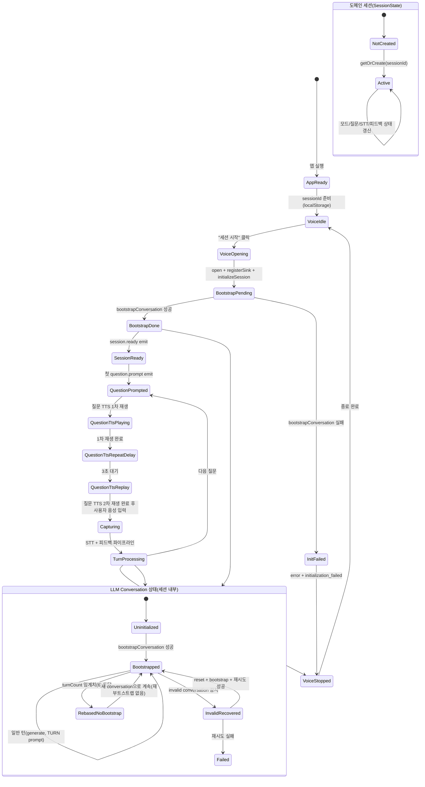

# Session State Diagram

```mermaid
stateDiagram-v2
    [*] --> AppReady: 앱 실행
    AppReady --> VoiceIdle: sessionId 준비(localStorage)

    state "도메인 세션(SessionState)" as DomainSession {
        [*] --> NotCreated
        NotCreated --> Active: getOrCreate(sessionId)
        Active --> Active: 모드/질문/STT/피드백 상태 갱신
    }

    VoiceIdle --> VoiceOpening: "세션 시작" 클릭
    VoiceOpening --> BootstrapPending: open + registerSink + initializeSession
    BootstrapPending --> BootstrapDone: bootstrapConversation 성공
    BootstrapPending --> InitFailed: bootstrapConversation 실패
    InitFailed --> VoiceStopped: error + initialization_failed

    BootstrapDone --> SessionReady: session.ready emit
    SessionReady --> QuestionPrompted: 첫 question.prompt emit
QuestionPrompted --> QuestionTtsPlaying: 질문 TTS 1차 재생
QuestionTtsPlaying --> QuestionTtsRepeatDelay: 1차 재생 완료
QuestionTtsRepeatDelay --> QuestionTtsReplay: 3초 대기
QuestionTtsReplay --> Capturing: 질문 TTS 2차 재생 완료 후 사용자 음성 입력
    Capturing --> TurnProcessing: STT + 피드백 파이프라인
    TurnProcessing --> QuestionPrompted: 다음 질문
    TurnProcessing --> VoiceStopped: 세션 종료/문제소진/강제중지

    VoiceStopped --> VoiceIdle: 종료 완료

    state "LLM Conversation 상태(세션 내부)" as LLMState {
        [*] --> Uninitialized
        Uninitialized --> Bootstrapped: bootstrapConversation 성공
        Bootstrapped --> Bootstrapped: 일반 턴(generate, TURN prompt)
        Bootstrapped --> RebasedNoBootstrap: turnCount 임계치(6) 도달
        RebasedNoBootstrap --> Bootstrapped: 새 conversation으로 계속(재부트스트랩 없음)
        Bootstrapped --> InvalidRecovered: invalid conversation 감지
        InvalidRecovered --> Bootstrapped: reset + bootstrap + 재시도 성공
        InvalidRecovered --> Failed: 재시도 실패
    }

    BootstrapDone --> LLMState
    TurnProcessing --> LLMState
```
